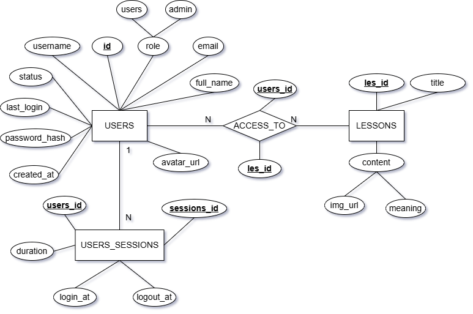

# 🤟 VISITALK — Ứng Dụng Dịch Ngôn Ngữ Ký Hiệu Thời Gian Thực

<div align="center">


**Xóa bỏ rào cản giao tiếp giữa người khiếm thính và cộng đồng**


</div>

---

## ✨ Tính Năng Chính

✅ **Dịch thuật thời gian thực** — Nhận diện cử chỉ tay qua webcam với AI Models  
✅ **Quản lý tài khoản** — Xác thực, hồ sơ, lịch sử phiên làm việc  
✅ **Hệ thống học tập** — Khóa học chào hỏi, bảng chữ cái, số đếm  
✅ **Dashboard Admin** — Quản lý người dùng, bài học, báo cáo  
✅ **Super Admin System** — Quản lý admin, cài đặt hệ thống  
✅ **Giao diện responsive** — Tối ưu cho mọi thiết bị  

---

## 🛠️ Công Nghệ

- **Frontend**: React 19 + Vite + React Router
- **Backend**: Node.js + Express + MySQL
- **AI**: MediaPipe + Gesture Recognition Models
- **Bảo mật**: JWT, bcrypt, Rate Limiting, CORS, Helmet

---

## 📁 Cấu Trúc Dự Án

```
VISITALK/
├── frontend/          # React + Vite (Port 5173)
│   └── src/
│       ├── pages/     # Translate, Learning, Admin, etc.
│       ├── components/
│       ├── services/  # API client
│       └── context/   # Auth state
├── backend/           # Node.js + Express (Port 5001)
│   ├── routes/
│   ├── controllers/
│   ├── middleware/
│   └── models/
├── models/            # AI Models (v1, v2)
└── VISITALK DB.txt    # Database Schema
```

---

## 💾 Database Schema



---

## 🚀 Cài Đặt & Chạy

### 1. Clone Repository
```bash
git clone https://github.com/Nhatpham12/VISITALK.git
cd VISITALK
```

### 2. Setup Database (MySQL)
```bash
mysql -u root -p
source "VISITALK DB.txt"
```

### 3. Setup Backend
```bash
cd backend
npm install
cp .env.example .env
# Cấu hình .env với thông tin MySQL, JWT_SECRET, etc.
npm start
# Backend chạy tại http://localhost:5001
```

### 4. Setup Frontend
```bash
cd frontend
npm install
npm run dev
# Frontend chạy tại http://localhost:5173
```

---

## 🌳 Quy Trình Người Dùng

1. **Đăng ký/Đăng nhập** — `/signup` → `/login`
2. **Sử dụng dịch thuật** — `/translate` (bật webcam, thực hiện cử chỉ)
3. **Học bài** — `/learning` (Greeting, Alphabet, Numbers)
4. **Quản lý hồ sơ** — `/personal` (xem/sửa thông tin)
5. **Admin Panel** — `/admin` (quản lý người dùng, bài học)

---

## 📈 Build & Deploy

### Build Frontend
```bash
cd frontend
npm run build    # Output: dist/
npm run preview  # Preview locally
```

### Deploy
- **Vercel**: `npm install -g vercel && vercel`
- **Netlify**: `netlify deploy --prod --dir=dist`
- **Heroku**: `heroku create visitalk-backend && git push heroku main`

---

## 🤝 Đóng Góp

```bash
git checkout -b feature/your-feature-name
git commit -m "feat: Mô tả tính năng"
git push origin feature/your-feature-name
# Tạo Pull Request trên GitHub
```

**Commit Format:**
- `feat:` - Tính năng mới
- `fix:` - Sửa lỗi
- `docs:` - Tài liệu
- `refactor:` - Cấu trúc lại

---

## 📚 Tài Liệu & Tham Khảo

- [React Docs](https://react.dev)
- [Express.js](https://expressjs.com)
- [MySQL2](https://github.com/sidorares/node-mysql2)
- [MediaPipe](https://mediapipe.dev)

---

## 📞 Liên Hệ

**Tác Giả**: Nhat Pham [@Nhatpham12](https://github.com/Nhatpham12)

- 📧 **Email**: [contact@visitalk.com]
- 💬 **Issues**: [GitHub Issues](https://github.com/Nhatpham12/VISITALK/issues)
- 🌐 **Website**: [visitalk.com]

---

## 📄 License

MIT License © 2024-2026 — Nhat Pham & Contributors

---

<div align="center">

### Made with ❤️ để mở ra những cơ hội giao tiếp mới


</div>
