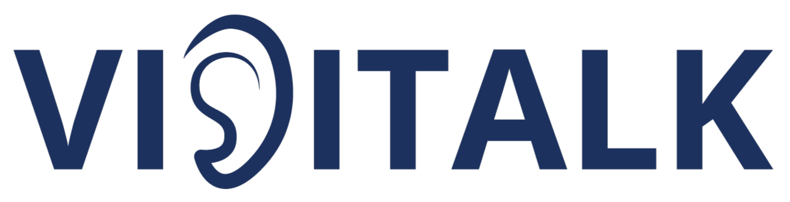

# 🤟 VISITALK — Ứng Dụng Dịch Ngôn Ngữ Ký Hiệu Thời Gian Thực

<div align="center">



**Xóa bỏ rào cản giao tiếp giữa người khiếm thính và cộng đồng**


</div>

---

## 📖 Giới Thiệu

**VISITALK** là một WebApp nhận diện và dịch ngôn ngữ ký hiệu theo thời gian thực, hoạt động như một **"phiên dịch viên ảo 24/7"** — không cần cài đặt, không cần phần mềm riêng. Chỉ cần bắt đầu và bắt tay nói chuyện! 🚀

Dự án được xây dựng nhằm giải quyết ba vấn đề cốt lõi:

| Vấn Đề | Giải Pháp của VISITALK |
|--------|----------------------|
| 🚫 Rào cản giao tiếp giữa người khiếm thính và người nghe nói | ✅ Dịch thuật tức thì qua camera |
| 💰 Chi phí thuê phiên dịch viên ngôn ngữ ký hiệu cao | ✅ Phiên dịch viên AI miễn phí 24/7 |
| ✏️ Giao tiếp qua giấy bút mất đi tính tự nhiên | ✅ Hội thoại trực tiếp, thời gian thực |

---

## ✨ Tính Năng

- 🎯 **Nhận diện tay thời gian thực** — Phát hiện 21 điểm khớp tay qua webcam thông thường
- ⚡ **Xử lý tốc độ cao** — Hiển thị FPS, không có độ trễ đáng kể
- 🌐 **Không cần cài đặt** — Chạy trực tiếp trên trình duyệt hiện đại
- 📱 **Đa nền tảng** — Hỗ trợ laptop, máy tính bảng, điện thoại
- 📝 **Dịch thuật sang văn bản** — Chuyển cử chỉ tay thành chữ viết
- 🎨 **Giao diện hiện đại** — Xây dựng với React + Vite, responsive trên mọi thiết bị

---

## 🏗️ Kiến Trúc Hệ Thống

```
┌─────────────────────────────────────┐
│   Frontend (React + Vite)           │
│  ├─ Giao diện người dùng            │
│  ├─ MediaPipe.js (JS Version)       │
│  └─ Real-time visualization         │
└──────────────┬──────────────────────┘
               │
               ↓ WebSocket/API
┌──────────────────────────────────────┐
│   Backend (Node.js / Python)         │
│  ├─ Xử lý MediaPipe Hands            │
│  ├─ ML Classifier (Nhận diện)        │
│  └─ Text/Speech Output               │
└──────────────┬───────────────────────┘
               │
               ↓
┌──────────────────────────────────────┐
│   Webcam Input → 21 Keypoints        │
│   → AI Classifier → Text Output 🔊   │
└──────────────────────────────────────┘
```

---

## 📁 Cấu Trúc Dự Án

```
VISITALK/
├── 📂 frontend/                    # React + Vite Frontend
│   ├── src/
│   │   ├── components/            # React Components
│   │   │   ├── Camera.jsx         # Component xử lý camera & MediaPipe
│   │   │   ├── Translator.jsx     # Component dịch thuật
│   │   │   ├── About.jsx          # Trang About
│   │   │   └── ...
│   │   ├── hooks/                 # Custom React Hooks
│   │   │   ├── useMediaPipe.js    # Hook nhận diện tay
│   │   │   └── useTranslator.js   # Hook dịch thuật
│   │   ├── styles/                # CSS modules
│   │   ├── utils/                 # Utility functions
│   │   ├── App.jsx
│   │   └── main.jsx
│   ├── public/
│   │   ├── Assets/
│   │   │   └── Images/            # Hình ảnh brand
│   │   └── models/                # MediaPipe models
│   ├── vite.config.js
│   ├── package.json
│   └── ...
├── 📂 backend/                     # Backend (Node.js/Python)
│   ├── HandTrackingModule.py       # MediaPipe tracking
│   ├── SeperatelyTracking.py       # Phân tích ngón tay
│   ├── volumeHandControl.py        # Demo tương tác
│   ├── index.js                    # Node.js server
│   └── requirements.txt
├── 📄 README.md
└── .gitignore
```

---

## 🛠️ Công Nghệ Sử Dụng

### Frontend Stack

| Công Nghệ | Mục Đích | Phiên Bản |
|-----------|---------|---------|
| **React** | UI Framework | 18+ |
| **Vite** | Build tool & Dev server | Latest |
| **MediaPipe Hands** | Hand gesture detection | JS SDK |
| **TensorFlow.js** | Machine Learning (Browser) | Latest |
| **Axios** | HTTP Client | Latest |
| **React Router** | Routing | 6+ |
| **CSS3 / Tailwind** | Styling | Latest |

### Backend Stack

| Công Nghệ | Mục Đích |
|-----------|---------|
| **Node.js** | Runtime & API Server |
| **Python 3.8+** | AI/ML Processing |
| **MediaPipe** | Hand tracking & recognition |
| **OpenCV** | Computer Vision |
| **TensorFlow** | Model training & inference |

### Modules Python

| Module | Chức Năng |
|--------|---------|
| `HandTrackingModule.py` | "Đôi mắt" của hệ thống — phát hiện bàn tay |
| `SeperatelyTracking.py` | Phân tích trạng thái từng ngón tay (co/duỗi) |
| `volumeHandControl.py` | Demo tương tác: cử chỉ tay → hành động |

---

## 🚀 Hướng Dẫn Cài Đặt & Chạy

### Yêu Cầu

- **Node.js** 16+ & **npm** hoặc **yarn**
- **Python** 3.8+
- **Webcam** (bắt buộc)
- **Trình duyệt hiện đại**: Chrome, Edge, Firefox (phiên bản mới)

### 1️⃣ Clone Repository

```bash
git clone https://github.com/Nhatpham12/VISITALK.git
cd VISITALK
```

### 2️⃣ Setup Frontend (React + Vite)

```bash
cd frontend

# Cài đặt dependencies
npm install
# hoặc
yarn install

# Chạy development server
npm run dev
# hoặc
yarn dev
```

Frontend sẽ chạy tại: **http://localhost:5173**

### 3️⃣ Setup Backend (Python)

```bash
cd backend

# Tạo virtual environment (tùy chọn nhưng khuyến khích)
python -m venv venv

# Kích hoạt virtual environment
# Windows:
venv\Scripts\activate
# macOS/Linux:
source venv/bin/activate

# Cài đặt dependencies
pip install -r requirements.txt
```

### 4️⃣ Chạy Backend (tùy chọn)

```bash
# Chạy Node.js server
node index.js

# Hoặc chạy Python module
python HandTrackingModule.py
```

---

## 📦 Cài Đặt Dependencies Chi Tiết

### Frontend Dependencies

```bash
npm install
# Tự động cài:
# - react@latest
# - react-dom@latest
# - vite@latest
# - @mediapipe/tasks-vision
# - @tensorflow/tfjs
# - axios
# - react-router-dom
# - tailwindcss (nếu sử dụng)
```

### Backend Dependencies (Python)

```bash
# Tạo requirements.txt nếu chưa có
pip install mediapipe opencv-python numpy tensorflow flask flask-cors

# hoặc cài từ requirements.txt
pip install -r requirements.txt
```

**Nội dung requirements.txt mẫu:**
```
mediapipe==0.10.0
opencv-python==4.8.0.76
numpy==1.24.3
tensorflow==2.13.0
flask==2.3.2
flask-cors==4.0.0
```

---

## 🎯 Build & Deploy

### Build Frontend cho Production

```bash
cd frontend

# Tạo production build
npm run build
# Output: dist/ folder

# Preview production build locally
npm run preview
```

### Deploy lên Vercel / Netlify

**Vercel:**
```bash
npm install -g vercel
vercel
```

**Netlify:**
```bash
npm install -g netlify-cli
netlify deploy --prod --dir=dist
```

---

## 🗺️ Lộ Trình Phát Triển

- [x] Module nhận diện bàn tay (MediaPipe)
- [x] Phân tích trạng thái ngón tay
- [x] Demo tương tác cử chỉ tay
- [x] Giao diện WebApp cơ bản
- [x] Chuyển sang React + Vite
- [ ] Tối ưu hóa performance
- [ ] Bộ dataset bảng chữ cái ngôn ngữ ký hiệu Việt Nam
- [ ] Triển khai TensorFlow.js hoàn toàn trên Browser
- [ ] Hỗ trợ Video streaming (RTC)
- [ ] Deploy lên cloud (Vercel / Netlify)
- [ ] Progressive Web App (PWA) support
- [ ] Offline mode

---

## 💡 Bối Cảnh & Động Lực

Dự án được hình thành từ sự giao thoa giữa **nhu cầu xã hội cấp thiết** và **sự chín muồi của công nghệ**:

> _Tại Việt Nam, hàng triệu người khiếm thính đang phải đối mặt với rào cản giao tiếp hằng ngày — khi đi mua sắm, khám bệnh, hay đơn giản là hỏi đường. Họ phải mang theo người phiên dịch, viết giấy, hoặc sử dụng những ứng dụng dịch chữ chậm chạp._

Nhờ sự phổ biến của **Computer Vision** (MediaPipe) và khả năng xử lý **thời gian thực** ngay trên trình duyệt, nay có thể xây dựng một **phiên dịch viên ngôn ngữ ký hiệu miễn phí, luôn sẵn sàng, hoàn toàn đáng tin cậy**.

**VISITALK** không chỉ là một ứng dụng — nó là **một cuộc cách mạng nhỏ trong giao tiếp**.

---

## 🤝 Đóng Góp

Mọi đóng góp đều được chào đón! Cách tham gia:

### 1. Fork Repository

Nhấp nút **Fork** trên GitHub

### 2. Tạo Feature Branch

```bash
git checkout -b feature/ten-tinh-nang
```

### 3. Commit Thay Đổi

```bash
git commit -m "feat: Thêm tính năng [tên chi tiết]"
```

### 4. Push Lên Branch

```bash
git push origin feature/ten-tinh-nang
```

### 5. Tạo Pull Request

Mở Pull Request từ GitHub và mô tả thay đổi của bạn rõ ràng.

### Hướng Dẫn Commit

- `feat:` - Tính năng mới
- `fix:` - Sửa lỗi
- `docs:` - Cập nhật tài liệu
- `style:` - Formatting
- `refactor:` - Cấu trúc lại code
- `test:` - Thêm/cập nhật test

---

## 📚 Tài Liệu & Tham Khảo

### MediaPipe
- [MediaPipe Hands Documentation](https://mediapipe.dev/solutions/hands)
- [MediaPipe Solutions](https://ai.google.dev/edge/mediapipe/solutions)

### React + Vite
- [React Documentation](https://react.dev)
- [Vite Documentation](https://vitejs.dev)
- [Vite + React Template](https://github.com/vitejs/vite/tree/main/packages/create-vite/template-react)

### TensorFlow.js
- [TensorFlow.js Documentation](https://www.tensorflow.org/js)
- [Hand Pose Detection](https://github.com/tensorflow/tfjs-models/tree/master/hand-pose-detection)

### Computer Vision
- [OpenCV Documentation](https://docs.opencv.org)
- [Python Computer Vision Guide](https://www.pyimagesearch.com)

---

## 🐛 Troubleshooting

### Camera không hoạt động
```bash
# Kiểm tra quyền truy cập camera
# Chrome: Cài đặt → Quyền → Camera
# Firefox: Cài đặt → Quyền → Camera
```

### MediaPipe không tải
```bash
# Đảm bảo có kết nối internet
# Kiểm tra console (F12) xem lỗi nào
# Xóa cache và tải lại trang
```

### Performance chậm
```bash
# Giảm resolution camera
# Tắt các features không cần thiết
# Kiểm tra CPU/GPU usage
```

---

## 📬 Liên Hệ & Hỗ Trợ

**Nhat Pham** — [@Nhatpham12](https://github.com/Nhatpham12)

- 📧 Email: [your-email@example.com]
- 💬 Issues: [GitHub Issues](https://github.com/Nhatpham12/VISITALK/issues)
- 💡 Discussions: [GitHub Discussions](https://github.com/Nhatpham12/VISITALK/discussions)

---

## 📄 License

MIT License © 2024 - Nhat Pham

---

<div align="center">

### Made with ❤️ để phục vụ cộng đồng người khiếm thính Việt Nam

**Hãy chia sẻ dự án này và giúp mở rộng cộng đồng!** ⭐


</div>
